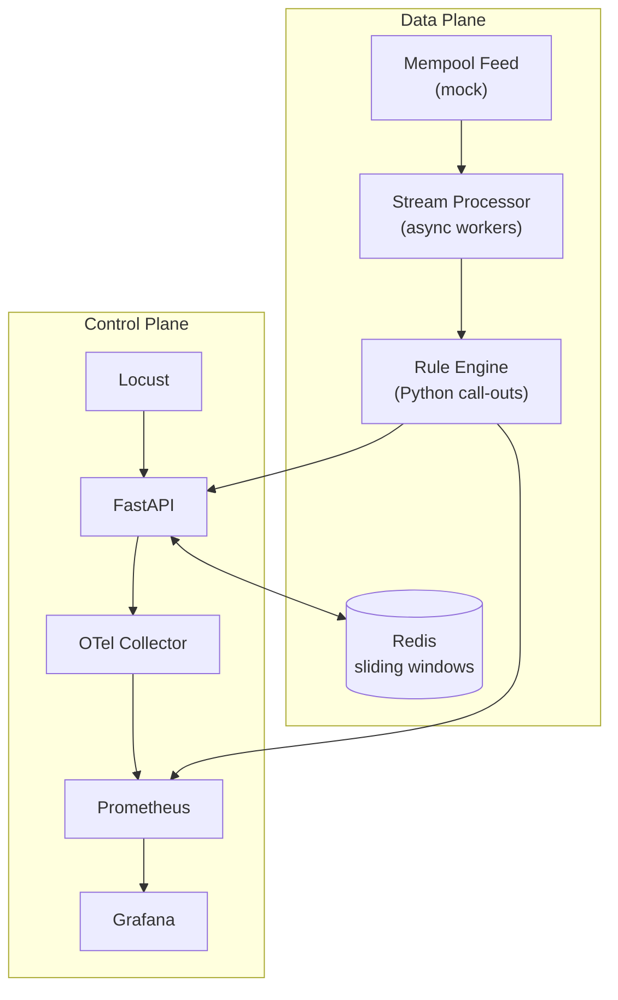

# Real-Time Fraud / MEV Monitor

Detect suspicious on-chain activity such as MEV sandwich attacks, dangerous approvals and anomalous transfer graphs *while the transaction is still sitting in the mempool*.

---

## Problem Statement
Block-space is a high-stakes auction. Attackers leverage information asymmetry in the public mempool to front-run or back-run honest users, or to seed malicious approvals that will be exploited later.  Security teams need a *low-latency* observable surface to spot these patterns **before** they are finalised on-chain.

## Approach (TL;DR)
1. **In-memory stream processor** (async + shared state) consumes a *mock* mempool feed.
2. **Rule Engine** – simple, composable Python call-outs; no external DSL to keep iteration tight.
3. **Sliding-window cache (Redis)** for quick cardinality checks (e.g. anomalous transfer graphs).
4. **FastAPI service layer** exposes health, metrics and alert endpoints.
5. **Observability** – Prometheus metrics & OpenTelemetry traces baked in from the start.
6. **Load generation** with Locust to keep an eye on p50 / p99 latencies under fire.

### High-level Architecture


## Quickstart
```bash
# Docker Compose v2+ required
docker compose up --build
```
Services:
- `http://localhost:8000` – FastAPI (docs at `/docs`)
- `http://localhost:9090` – Prometheus
- `http://localhost:3000` – Grafana (admin/admin)
- `http://localhost:8089` – Locust UI


